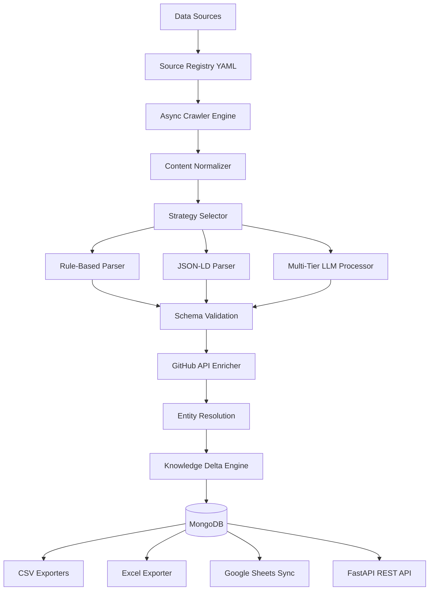

# 🚀 Adaptive Intelligence Ingestion Pipeline (AIIP)


> **GraphOne** is the overall project repository. **Adaptive Intelligence Ingestion Pipeline (AIIP)** is its core backend ingestion engine.
>
> AIIP is a modular backend pipeline for ingesting, validating, resolving, and tracking structured intelligence from the AI ecosystem.

---

## 📌 Table of Contents
- [📊 Final Results](#-final-results)
- [🎯 Assignment Deliverables](#-assignment-deliverables)
- [📖 Overview](#-overview)
- [🏗️ System Architecture](#️-system-architecture)
- [🧠 Hybrid Extraction Engine](#-hybrid-extraction-engine)
- [📡 API Endpoints & Swagger](#-api-endpoints--swagger)
- [📁 Folder Structure](#-folder-structure)
- [⚡ Scalability & Performance](#-scalability--performance)
- [🛠️ Engineering Highlights](#️-engineering-highlights)
- [⚙️ Getting Started](#️-getting-started)
- [🌐 Live Deployment](#-live-deployment)
- [⚠️ Known Limitations](#️-known-limitations)
- [📄 License](#-license)

---

## 📊 Final Results

The pipeline successfully executed a full end-to-end extraction run yielding the following verified, deduplicated database records:

| Dataset | Records | Target | Status |
|:---|---:|:---:|:---:|
| **Startups** | **5,754** | 1000+ | ✅ Achieved |
| **Products** | **1,103** | 1000+ | ✅ Achieved |
| **Research Papers** | **1,097** | 1000+ | ✅ Achieved |
| **News** | **176** | 50+ | ✅ Achieved |
| **Jobs** | **149** | 50+ | ✅ Achieved |
| **Entity Mappings** | **7,122** | N/A (Generated During Entity Resolution) | ✅ Achieved |

---

## 🎯 Assignment Deliverables

| Requirement | Status | Description |
|:---|:---:|:---|
| **1000+ Startups** | ✅ Achieved | 5,754 startups ingested from YC Companies API |
| **1000+ Products** | ✅ Achieved | 1,103 products/repos ingested from GitHub API and Trending |
| **1000+ Research Papers** | ✅ Achieved | 1,097 papers ingested from arXiv queries |
| **AI News Monitoring** | ✅ Achieved | 176 articles ingested from TechCrunch, ZDNet, Wired, VB, HF, and Google |
| **AI Job Monitoring** | ✅ Achieved | 149 jobs ingested from YC Jobs, RemoteOK, WWR, and AIJobsBoard |
| **Entity Resolution** | ✅ Achieved | RapidFuzz fuzzy name normalization with pre-seeded startups |
| **Knowledge Delta Engine**| ✅ Achieved | Deterministic merges, priority precedence, and ChangeHistory logs |
| **MongoDB Storage** | ✅ Achieved | MongoDB Atlas connection and repositories configured |
| **CSV Export** | ✅ Achieved | 6 flattened CSVs exported to `outputs/` directory |
| **Excel Export** | ✅ Achieved | Multi-sheet workbook exported to `outputs/excel/AIIP_Output.xlsx` |
| **Google Sheets Export** | ✅ Achieved | Implemented but requires Google credentials and verification before production use |
| **REST API Endpoints** | ✅ Achieved | Read-only FastAPI dataset endpoints exposed on `/docs` |
| **Deployment** | ✅ Achieved | Deployed live on Render Web Services |

---

## 📖 Overview

The **Adaptive Intelligence Ingestion Pipeline (AIIP)** is a scalable data ingestion system designed to transform unstructured information from multiple AI-related sources into validated, structured, and versioned knowledge.

Unlike traditional scrapers, AIIP detects incremental knowledge changes using a **Knowledge Delta Engine**, updating only modified entities while maintaining historical change records.

The pipeline automatically collects information about **AI startups, products, research papers, jobs, and news**, processes it using a hybrid extraction strategy, resolves duplicate entities, tracks changes over time, and exposes the final dataset via **REST API**, **MongoDB**, **CSV**, **Excel**, and **Google Sheets**.

---

## 🏗️ System Architecture

Detailed architectural documentation is available in [architecture.md](file:///c:/Users/jishn/OneDrive/Desktop/Jishnu/AI%20Signal/architecture.md).



---

## 🧠 Hybrid Extraction Engine

The pipeline automatically selects the most suitable extraction strategy using a cascaded decision tree to maximize extraction quality and efficiency:

```text
API available?
      │
     Yes ──► API Parser ──► Done
      │
      No
      │
JSON-LD exists?
      │
     Yes ──► JSON-LD Parser ──► Done
      │
      No
      │
Rule Extraction?
      │
     Yes ──► Rule Parser ──► Done
      │
      No
      │
LLM Extraction ──► Multi-LLM Fallback ──► Done
```

---

## 📡 API Endpoints & Swagger

The FastAPI application (`src/api/app.py`) exposes interactive Swagger UI documentation at `/docs` with MongoDB-level query pagination (`limit`, `skip`) and case-insensitive regex field filtering:

### Operational Endpoints
- `GET /` — Service directory map
- `GET /health` — Service health check
- `GET /metrics` — Operational telemetry metrics

### Dataset Endpoints
- `GET /startups` — Paginated AI startups (`limit`, `skip`, `name`)
- `GET /products` — Paginated AI products (`limit`, `skip`, `startup`)
- `GET /research-papers` — Paginated research papers (`limit`, `skip`, `title`)
- `GET /jobs` — Paginated AI job postings (`limit`, `skip`, `company`)
- `GET /news` — Paginated AI news signals (`limit`, `skip`, `title`)
- `GET /entity-mappings` — Fuzzy entity resolution logs (`limit`, `skip`, `raw_name`)
- `GET /changes` — Audit change history logs (`limit`, `operation`, `entity_id`)

---

## 📁 Folder Structure

```text
├── docs/                # Architecture and system documentation resources
├── outputs/             # Exported CSVs and Excel workbooks
│   └── excel/           # AIIP_Output.xlsx final multi-sheet workbook
├── src/
│   ├── api/             # FastAPI application and endpoint routes (app.py)
│   ├── config/          # Source registry definitions (sources.yaml) & settings
│   ├── crawler/         # Async Playwright & HTTP crawlers + normalizer
│   ├── database/        # MongoDB repositories and models
│   ├── delta/           # Knowledge Delta Engine for incremental updates
│   ├── exporters/       # CSV, Excel, and Google Sheets exporters
│   ├── llm/             # Multi-tier LLM clients (Gemini, Groq, OpenRouter)
│   ├── metrics/         # Run-time operational metrics collector
│   ├── pipeline/        # Validators, chunking processor, strategy selectors
│   ├── resolution/      # RapidFuzz entity resolver
│   ├── utils/           # GitHub REST API client & helpers
│   └── main.py          # CLI entrypoint for testing and full runs
├── Procfile             # Render web service start command
├── render.yaml          # Render Blueprint infrastructure spec
├── runtime.txt          # Python runtime version
├── requirements.txt     # Python dependencies
└── README.md            # Project documentation
```

---

## ⚡ Scalability & Performance

The pipeline is architected to scale efficiently:
- **Asynchronous Crawling**: High-performance HTTP fetching using aiohttp with custom worker semaphore limits.
- **MongoDB Offset Pagination**: Pagination (`limit`, `skip`) executed directly on database cursors inside PyMongo.
- **SHA-256 Caching**: Checks content integrity before LLM invocation and GitHub API calls, skipping repetitive API costs.
- **GitHub API Enrichment**: Automated repository metadata enrichment (stars, forks, language, description) with persistent DB caching.

---

## 🛠️ Engineering Highlights

During development, the pipeline was enhanced to solve several production challenges:
- **Multi-Provider Fallback**: Seamless rate limit failovers (Gemini → Groq → OpenRouter) maintaining structured outputs.
- **Large-Page Chunking**: Splits dense pages (e.g., ZDNet's 17KB payload) into overlapping blocks, merging outputs and removing duplicates.
- **SPA Waiting Strategy**: Integrates source-specific `networkidle` waits to handle JavaScript-gated React applications.
- **Data Quality Filtering**: Rejects scraper button artifacts (e.g., "See more jobs") and placeholder categories in job listings.

---

## ⚙️ Getting Started

### 1. Clone the Repository
```bash
git clone https://github.com/Jishnu-Thakker-27/GraphOne.git
cd GraphOne
```

### 2. Install Dependencies
```bash
pip install -r requirements.txt
pip install playwright
playwright install chromium
```

### 3. Configure Environment Variables
Create a `.env` file in the root directory:
```env
GEMINI_API_KEY=your_gemini_key
GROQ_API_KEY=your_groq_key
OPENROUTER_API_KEY=your_openrouter_key
MONGODB_URI=mongodb://localhost:27017/
```

### 4. Run the Pipeline & API Server
```bash
# Run full ingestion pipeline and exports
python -m src.main --all

# Start local FastAPI web server
uvicorn src.api.app:app --reload
```

---

## 🌐 Live Deployment

The application is deployed live on Render:

- **API**: https://aiip-api.onrender.com
- **Swagger**: https://aiip-api.onrender.com/docs
- **Health**: https://aiip-api.onrender.com/health

---

## ⚠️ Known Limitations

- **Google Sheets Live Sync**: Implemented but requires Google credentials and verification before production use.
- **Scheduling**: Pipeline runs via CLI trigger (`python -m src.main --all`); external scheduling (e.g. Render Cron Jobs or APScheduler) is recommended for continuous background automated runs.

---

## 📄 License

This project is released under the **MIT License**.