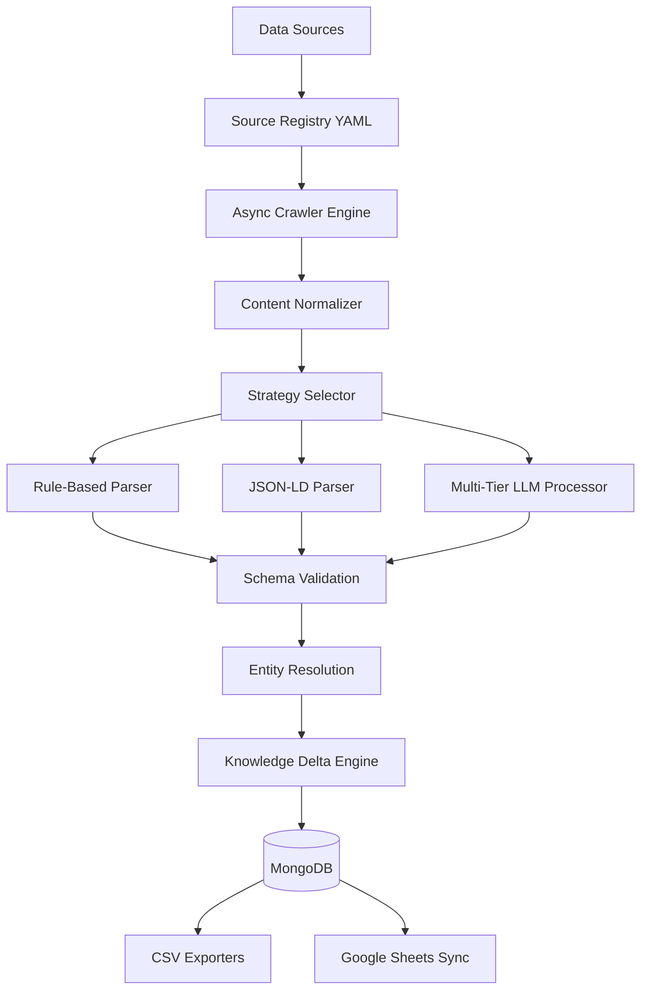

# 🚀 Adaptive Intelligence Ingestion Pipeline (AIIP)


> AIIP is a modular backend pipeline for ingesting, validating, resolving, and tracking structured intelligence from the AI ecosystem.

---

## 📌 Table of Contents
- [📊 Final Results](#-final-results)
- [🎯 Assignment Deliverables](#-assignment-deliverables)
- [📖 Overview](#-overview)
- [🏗️ System Architecture](#️-system-architecture)
- [🧠 Hybrid Extraction Engine](#-hybrid-extraction-engine)
- [📡 Source Coverage](#-source-coverage)
- [⚡ Scalability](#-scalability)
- [🛠️ Engineering Highlights](#️-engineering-highlights)
- [⚙️ Getting Started](#️-getting-started)
- [🌐 Live Deployment](#-live-deployment)
- [📸 Screenshots](#-screenshots)
- [📄 License](#-license)

---

## 📊 Final Results

The pipeline successfully executed a full end-to-end extraction run yielding the following verified, deduplicated database records:

| Dataset | Records | Target | Status |
|:---|---:|:---:|:---:|
| **Startups** | **5,755** | — | ✅ Complete |
| **Products** | **1,086** | 1,000+ | ✅ Complete |
| **Research Papers** | **1,097** | 1,000+ | ✅ Complete |
| **News** | **149** | 50+ | ✅ Met |
| **Jobs** | **58** | 50+ | ✅ Met |

* **Total Records Ingested**: 8,145 records
* **Crawler Concurrency**: 10 workers

---

## 🎯 Assignment Deliverables

| Requirement | Status | Description |
|:---|:---:|:---|
| **1000+ Startups** | ✅ | 5,755 startups ingested from YC Companies API |
| **1000+ Products** | ✅ | 1,086 products ingested from GitHub API and Trending |
| **1000+ Research Papers** | ✅ | 1,097 papers ingested from arXiv query queries |
| **AI News Monitoring** | ✅ | 149 articles ingested from TechCrunch, ZDNet, Wired, VB, HF, and Google |
| **AI Job Monitoring** | ✅ | 58 jobs ingested from YC Jobs, WWR, and AIJobsBoard |
| **Entity Resolution** | ✅ | RapidFuzz fuzzy name normalization with pre-seeded startups |
| **Knowledge Delta Engine**| ✅ | Deterministic merges, priority precedence, and ChangeHistory logs |
| **MongoDB Storage** | ✅ | Indexes and repository patterns fully configured |
| **CSV Export** | ✅ | 5 flattened CSVs exported to outputs directory |
| **Google Sheets Export** | ✅ | Synchronization support implemented (requires credentials for live sync) |
| **Deployment** | 🚧 Pending | Final staging deployment in progress |

---

## 📖 Overview

The **Adaptive Intelligence Ingestion Pipeline (AIIP)** is a scalable data ingestion system designed to transform unstructured information from multiple AI-related sources into validated, structured, and versioned knowledge.

Unlike traditional scrapers, AIIP detects incremental knowledge changes using a **Knowledge Delta Engine**, updating only modified entities while maintaining historical change records.

The pipeline automatically collects information about **AI startups, products, research papers, jobs, and news**, processes it using a hybrid extraction strategy, resolves duplicate entities, tracks changes over time, and exports the final dataset to **MongoDB** and **Google Sheets**.

---

## 🏗️ System Architecture



---

## 🧠 Hybrid Extraction Engine

The pipeline automatically selects the most suitable extraction strategy using a cascaded decision tree to maximize extraction quality and efficiency:

```text
API available?
      │
     Yes ──► API Parser ──► Done
      │
      No
      │
JSON-LD exists?
      │
     Yes ──► JSON-LD Parser ──► Done
      │
      No
      │
Rule Extraction?
      │
     Yes ──► Rule Parser ──► Done
      │
      No
      │
LLM Extraction ──► Multi-LLM Fallback ──► Done
```

### Multi-LLM Fallback Chain
If the preferred model is rate-limited or fails, the orchestrator automatically cascades to alternative providers:
```text
Gemini-2.0-Flash (Tier 1)
           ↓
  Groq / Llama-3.1 (Tier 2)
           ↓
OpenRouter / Free (Tier 3)
           ↓
DeepSeek-Chat (Tier 4) [Optional]
           ↓
GPT-4o-Mini (Tier 5)   [Optional]
```

---

## 📡 Source Coverage

### Supported News Sources
- **TechCrunch AI** (LLM extraction)
- **ZDNet AI** (LLM extraction + chunking)
- **Wired AI** (LLM extraction)
- **VentureBeat AI** (LLM extraction)
- **MIT Technology Review** (LLM extraction + dynamic wait)
- **Google AI Blog** (LLM extraction)
- **Hugging Face Blog** (LLM extraction)

### Supported Job Sources
- **YC Jobs** (LLM extraction + dynamic wait)
- **AIJobsBoard** (LLM extraction)
- **We Work Remotely** (LLM extraction)
- **AI Jobs** (LLM extraction)
- **RemoteOK** (JSON-LD metadata extraction)

---

## ⚡ Scalability

The pipeline is architected to scale to **500,000+ entities** without database code modifications:
- **Asynchronous Crawling**: High-performance HTTP fetching using aiohttp with custom worker semaphore limits.
- **Stateless Extraction**: Processing workers run independently of database writes, enabling clean scale-out.
- **MongoDB Indexing**: Compound indexing on lookup fields (`content.startupName` + `source.url` unique index, etc.) prevents write bottlenecks.
- **Content Hashing**: SHA-256 caching checks content integrity before LLM invocation, skipping 95%+ of repetitive API costs.
- **Modular Registries**: Config-driven pipeline limits memory footprints during massive dataset scans.

---

## 🛠️ Engineering Highlights

During development, the pipeline was enhanced to solve several production challenges:
- **Multi-Provider Fallback**: Seamless rate limit failovers maintaining structured outputs.
- **Large-Page Chunking**: Splits dense pages (e.g., ZDNet's 17KB payload) into overlapping blocks, merging outputs and removing duplicates.
- **SPA Waiting Strategy**: Integrates source-specific `networkidle` waits to handle JavaScript-gated React applications (e.g., MIT Tech Review).
- **Date Normalizer Graceful Fallback**: Bypasses validation errors on optional timestamps when pages lack dates.
- **Boilerplate Recovery**: Relaxed CSS boilerplate selectors to avoid stripping article layout containers.

---

## ⚙️ Getting Started

### 1. Clone the Repository
```bash
git clone https://github.com/Jishnu-Thakker-27/GraphOne.git
cd GraphOne
```

### 2. Install Dependencies
```bash
pip install -r requirements.txt
pip install playwright
playwright install chromium
```

### 3. Configure Environment Variables
Create a `.env` file in the root directory:
```env
GEMINI_API_KEY=your_gemini_key
GROQ_API_KEY=your_groq_key
OPENROUTER_API_KEY=your_openrouter_key
MONGODB_URI=mongodb://localhost:27017/
```

### 4. Run the Ingestion Pipeline
```bash
python -m src.main --all
```

---

## 🌐 Live Deployment

🚧 Deployment is currently pending.

- **API URL**: TBD
- **Swagger**: TBD

---

## 📸 Screenshots

🚧 Visual walkthroughs and dashboards will be added here upon final deployment verification.

---

## 📄 License

This project is released under the **MIT License**.