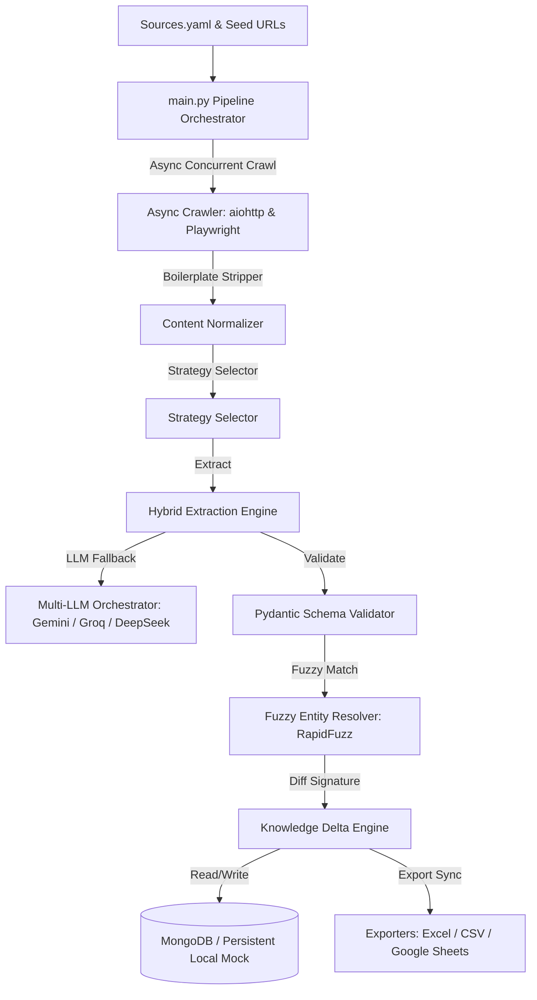
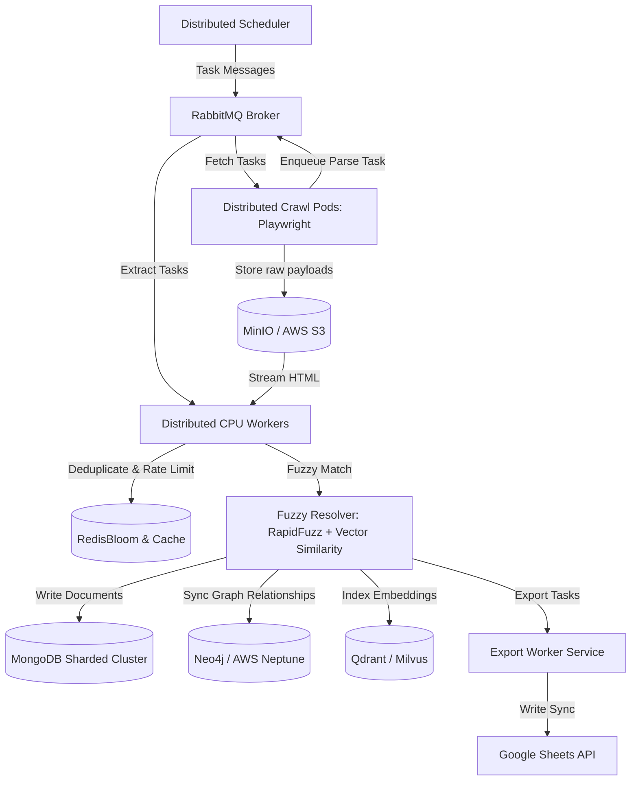

# AIIP System Architecture & Production Design

This document details the architectural design, current technology stack, and future scaling plans for the **Adaptive Intelligence Ingestion Pipeline (AIIP)**. It distinguishes between the **currently implemented and delivered components** and the **future production scaling strategy** designed to handle over 500,000 records.

---

## 1. System Topology Designs

### A. Current Pipeline Implementation (Delivered & Verified)
The system operates as a single-node asynchronous pipeline utilizing Python's `asyncio` loop, memory-efficient queues, and structured schemas to manage concurrent ingestion.



### B. Future Production Scaling Architecture (Distributed Plan)
For high-volume production deployments ($\ge 500,000$ records), the system transitions to a **distributed, containerized worker-based architecture**.



---

## 2. Current Technology Stack

The following technologies are fully implemented and functional within this project submission:

| Layer | Technology | Purpose |
| :--- | :--- | :--- |
| **Backend & API** | **FastAPI + Uvicorn** | Provides REST endpoints for pipeline execution, operational metrics (`/metrics`), health monitoring (`/health`), and interactive API documentation (`/docs`). |
| **Crawling Engine** | **aiohttp + Playwright Async** | Concurrent network client with Headless Chromium fallback for dynamic JS rendering. |
| **Concurrency** | **asyncio** | Async Task orchestrator utilizing semaphores to cap active requests. |
| **Validation** | **Pydantic v2** | Data transfer schemas, type enforcement, and field-level sanitizers. |
| **LLM Inference** | **Google GenAI + Fallbacks** | Multi-tier failover orchestrator (Gemini 2.5 Flash $\rightarrow$ Groq Llama 3.1 $\rightarrow$ DeepSeek). |
| **Fuzzy Matching** | **RapidFuzz** | In-memory string distance matching using token set ratios. |
| **Knowledge Delta** | **Evidence Signature** | Deterministic diff engine mapping state updates. |
| **Primary Database** | **MongoDB** | Core document storage (with a persistent file-backed JSON mock fallback). |
| **Logging** | **Loguru** | Structured logging, trace captures, and run metrics. |
| **Exporters** | **Pandas + openpyxl + gspread** | Local CSV and multi-sheet Excel output synced to Google Sheets. |

---

## 3. Scale Strategy (Future Production Path)

Scaling to 500,000+ startups, products, and papers requires shifting from asynchronous loops to distributed queue workers.

- **Decoupled Workers via RabbitMQ**: Task scheduling is managed via a centralized **RabbitMQ** broker. Lightweight Python crawler pods consume fetch messages, retrieve source HTMLs, write raw payloads to an S3 bucket, and publish extraction tasks. Each crawl task is stateless and idempotent, allowing failed jobs to be retried safely without creating duplicate records.
- **Auto-Scaling Compute Nodes**: Processing nodes run as containerized Kubernetes pods. They perform semantic cleaning and extraction asynchronously, scaling horizontally (HPA) using KEDA based on RabbitMQ queue depth.

---

## 4. Resilient LLM Orchestration & Context Management

To avoid context overflows (413) and rate limits (429) during high-throughput LLM parsing, we apply targeted mitigations:

### A. Context Limit (413) Mitigation
- **Clean HTML Normalization**: Boilerplate text, headers, and footer components are stripped using BeautifulSoup/Selectolax, compressing payloads by up to **99.5%**.
- **Semantic Chunking**: Long documents are parsed into logical sections using:
  $$\text{Semantic Chunking} \longrightarrow \text{Top-k Relevant Chunks} \longrightarrow \text{LLM Extraction}$$
  This avoids feeding redundant text to the model's context window.

### B. Rate Limit (429) Mitigation
- **Token Bucket Limiter**: Standardizes API consumption rates.
- **Tiered API Failover**: Automatic, jittered retries routing from Gemini 2.5 Flash to Groq Llama 3.1 and DeepSeek in sequence.

---

## 5. Freshness Tracking & Deduplication

Ingestion workers must never crawl identical URLs or duplicate records across nodes.

### A. Bloom Filter (RedisBloom in Production)
- Before spawning a Chromium page request, crawler nodes check a Bloom Filter (implemented via **RedisBloom** in production) using `SHA-256(URL)` to determine in $O(1)$ time if the URL was visited in the last 24 hours.

### B. Evidence Signature Diffs
- When a publication date is missing, freshness is determined by computing an **Evidence Signature** composed of:
  ```text
  Evidence Signature =
  SHA-256(
    Normalized Entity Fields
    + Stable Metadata
    + GitHub Repository Metadata
    + Content Hash
  )
  ```
- This signature applies generically to entities whether they are Startups, Jobs, News, or Research Papers (with GitHub metadata contributing as part of the repository metadata when applicable). If the signature matches the existing database document, the record is skipped, saving database IOPS. If it differs, the entity is updated with `observed_at = crawl timestamp`.

---

## 6. Hybrid Storage Strategy

| Storage Layer | Technology (Current / Future) | Role | Justification |
| :--- | :--- | :--- | :--- |
| **Primary Document Store** | **MongoDB** (Current) | Core Entity Records | Schema flexibility accommodates semi-structured data additions without schema migration overhead. |
| **Graph Database** | **Neo4j / Neptune** (Future) | Relationship Ingestion | Maps complex connections between Startups, Products, research authors, and Jobs in constant time ($O(1)$ per hop). |
| **Vector Search Engine** | **Qdrant / pgvector** (Future) | Semantic Search & Discovery | Stores high-dimensional embeddings of entity descriptions to support semantic duplicate detection and discovery. |

---

### Graph Relationship Mapping Schema (Future Production Layer)
```text
(Startup: "OpenAI")-[:DEVELOPED]->(Product: "ChatGPT")
(Product)-[:CREATED_BY]->(Startup)
(ResearchPaper: "GPT-4 Report")-[:RELEASES]->(Product: "GPT-4")
(ResearchPaper)-[:IMPLEMENTED_BY]->(GitHubRepository)
(Job: "LLM Engineer")-[:OFFERED_BY]->(Startup: "OpenAI")
```
This hybrid model pairs MongoDB's fast writes with Neo4j's relational path traversal to serve a complete Intelligence Graph.

---

## 7. Why this Architecture?

The implemented architecture prioritizes deterministic extraction, structured validation, and modular processing while minimizing unnecessary LLM usage. The production architecture extends the same pipeline through distributed workers, caching, and scalable storage without requiring changes to the extraction logic. This separation ensures that the current implementation remains lightweight for the trial while providing a clear migration path toward large-scale deployment.
