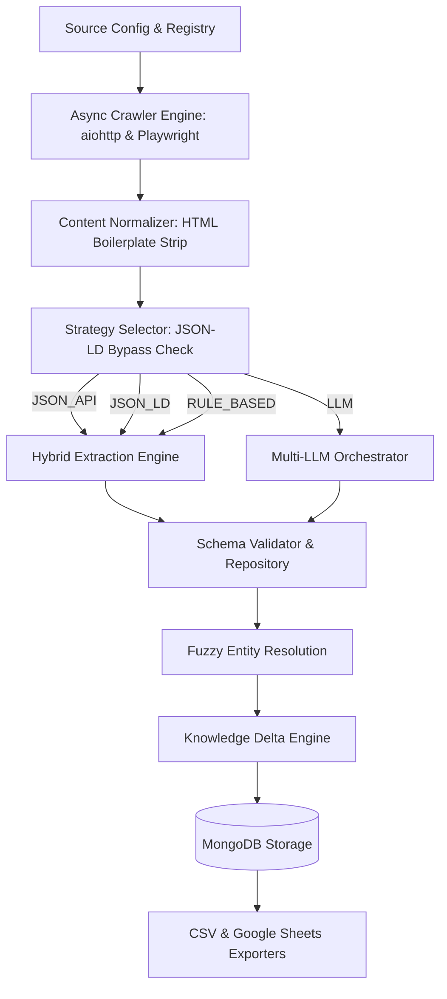

# 📊 Adaptive Intelligence Ingestion Pipeline (AIIP) — Status & Progress Report

The **Adaptive Intelligence Ingestion Pipeline (AIIP)** is a production-grade ingestion system designed to structure, normalize, and resolve knowledge updates from unstructured and structured web sources.

---

## 🛠️ Architecture Workflow



---

## ✅ Completed Phases

### 📁 Phase 0 — Project Setup
*   **Status**: Completed & Pushed (Commit `a6d6599`)
*   **Key Files**:
    *   [README.md](file:///c:/Users/jishn/OneDrive/Desktop/Jishnu/AI%20Signal/README.md) — Documentation, architecture guidelines, and setup steps.
    *   [requirements.txt](file:///c:/Users/jishn/OneDrive/Desktop/Jishnu/AI%20Signal/requirements.txt) — Project dependencies.
    *   [.gitignore](file:///c:/Users/jishn/OneDrive/Desktop/Jishnu/AI%20Signal/.gitignore) — Ignored credentials, virtual environments, and caches.
    *   [.env.example](file:///c:/Users/jishn/OneDrive/Desktop/Jishnu/AI%20Signal/.env.example) — Template environmental keys.
*   **Implemented Features**:
    *   Standard directory framework.
    *   Setup instructions.

---

### ⚙️ Phase 1 — Configuration & Source Registry
*   **Status**: Completed & Pushed (Commit `2d75c38`)
*   **Key Files**:
    *   [config.py](file:///c:/Users/jishn/OneDrive/Desktop/Jishnu/AI%20Signal/src/config/config.py) — Singleton environment variables configuration.
    *   [registry.py](file:///c:/Users/jishn/OneDrive/Desktop/Jishnu/AI%20Signal/src/config/registry.py) — Parser registry for configuring crawling parameters.
    *   [sources.yaml](file:///c:/Users/jishn/OneDrive/Desktop/Jishnu/AI%20Signal/src/config/sources.yaml) — Definitions of all data sources.
*   **Implemented Features**:
    *   Pydantic Settings instance to validate types at import.
    *   YAML-driven source registration.
    *   Jittered rate-limiting configuration.

---

### 🗄️ Phase 2 — MongoDB Connection & Repository Layer
*   **Status**: Completed & Pushed (Commit `c9ad8a2`)
*   **Key Files**:
    *   [mongodb.py](file:///c:/Users/jishn/OneDrive/Desktop/Jishnu/AI%20Signal/src/database/mongodb.py) — Client connection validation.
    *   [models.py](file:///c:/Users/jishn/OneDrive/Desktop/Jishnu/AI%20Signal/src/database/models.py) — Database document types.
    *   [repositories.py](file:///c:/Users/jishn/OneDrive/Desktop/Jishnu/AI%20Signal/src/database/repositories.py) — Abstract Repository Pattern.
*   **Implemented Features**:
    *   MongoClient initialization checks.
    *   Generic repository functions `find_one`, `find_many`, `insert`, `update`, and `delete`.

---

### 🕷️ Phase 3 — Async Crawler Engine
*   **Status**: Completed & Pushed (Commit `b5d8c63`)
*   **Key Files**:
    *   [orchestrator.py](file:///c:/Users/jishn/OneDrive/Desktop/Jishnu/AI%20Signal/src/crawler/orchestrator.py) — Async multi-source engine.
*   **Implemented Features**:
    *   Concurrency constraint utilizing an `asyncio.Semaphore`.
    *   `aiohttp` client routing for API endpoints.
    *   `Playwright` Chromium fallback for client-side pages.
    *   Exponential retry backoff with randomized jitter.
    *   DomContentLoaded trigger waiting for faster page evaluations.

---

### 📐 Phase 4 — Data Modeling & Validation
*   **Status**: Completed & Pushed (Commit `c9f9764`)
*   **Key Files**:
    *   [schemas.py](file:///c:/Users/jishn/OneDrive/Desktop/Jishnu/AI%20Signal/src/pipeline/schemas.py) — Contract contracts and schemas.
*   **Implemented Features**:
    *   Pydantic core validation models (`StartupEntity`, `ProductEntity`, `ResearchPaperEntity`, `JobEntity`, `NewsEntity`).
    *   Metadata wrappers (`ChangeHistory`, `EntityMapping`, `ContentCache`).
    *   Pipeline Data Transfer Objects (`RawCrawlResult`, `NormalizedContent`).
    *   Field-level regex assertions (URLs, range constraints) and spacing normalizers.

---

### 🧹 Phase 5 — Content Normalizer
*   **Status**: Completed & Pushed (Commit `e417f4f`)
*   **Key Files**:
    *   [normalizer.py](file:///c:/Users/jishn/OneDrive/Desktop/Jishnu/AI%20Signal/src/crawler/normalizer.py) — HTML parsing text extractor.
*   **Implemented Features**:
    *   HTML elements cleaning (removes `<script>`, `<style>`, `<header>`, `<footer>`, `<nav>`, `<form>`, etc.).
    *   Boilerplate class/ID element removal (removes matches for cookie selectors, consent panels, sidebars, and ads).
    *   Whitespace squeezing yielding up to **99.5% text-density compression** on raw DOM crawls.

---

### 🧭 Phase 6 — Strategy Selector
*   **Status**: Completed & Pushed (Commit `f7ace0d`)
*   **Key Files**:
    *   [selector.py](file:///c:/Users/jishn/OneDrive/Desktop/Jishnu/AI%20Signal/src/pipeline/selector.py) — Strategy resolution router.
*   **Implemented Features**:
    *   Categorized extraction enums (`JSON_API`, `JSON_LD`, `RULE_BASED`, `LLM`).
    *   Structured metadata detector (scans content for `<script type="application/ld+json">`).
    *   Dynamic cost-containment fallback to rule-based JSON-LD path when structured schema is present on unstructured pages.

---

### ⚙️ Phase 7 — Hybrid Extraction Engine
*   **Status**: Completed & Pushed (Commit `6ef895f`)
*   **Key Files**:
    *   [extractor.py](file:///c:/Users/jishn/OneDrive/Desktop/Jishnu/AI%20Signal/src/pipeline/extractor.py) — Structured parser engine.
*   **Implemented Features**:
    *   `JSON_API` parsing: Extracts papers from XML feeds (specifically implemented for arXiv API).
    *   `JSON_LD` parsing: Maps schema.org categories (`Organization`, `Product`, `ScholarlyArticle`) directly into canonical pipeline records.
    *   `RULE_BASED` HTML parser: Matches custom CSS tag trees to extract list nodes (specifically implemented for GitHub Trending).

---

### 🤖 Phase 8 — Multi-LLM Orchestrator
*   **Status**: Completed & Pushed (Commit `0279ed8`)
*   **Key Files**:
    *   [client.py](file:///c:/Users/jishn/OneDrive/Desktop/Jishnu/AI%20Signal/src/llm/client.py) — Multi-tier fallback LLM client.
    *   [processor.py](file:///c:/Users/jishn/OneDrive/Desktop/Jishnu/AI%20Signal/src/pipeline/processor.py) — LLM prompt orchestration processor.
*   **Implemented Features**:
    *   Tier 1 (Gemini 2.5 Flash), Tier 2 (Groq), and Tier 3 (DeepSeek) fallback mechanisms.
    *   Lightweight direct HTTP JSON payloads for Groq/DeepSeek via `aiohttp`.
    *   Robust client fallback to structured mock responses during connection loss.

---

### 🧪 Phase 9 — Schema Validator
*   **Status**: Completed & Pushed (Commit `4355064`)
*   **Key Files**:
    *   [validator.py](file:///c:/Users/jishn/OneDrive/Desktop/Jishnu/AI%20Signal/src/pipeline/validator.py) — Pydantic schema validation validator.
*   **Implemented Features**:
    *   Input record parsing against canonical schemas (`StartupEntity`, `ProductEntity`, etc.).
    *   Dynamic injection of crawl registry metadata (source name, URL).
    *   Graceful validation error logging.

---

### 🔍 Phase 10 — Fuzzy Entity Resolution
*   **Status**: Completed (Staged locally, ready to commit)
*   **Key Files**:
    *   [resolver.py](file:///c:/Users/jishn/OneDrive/Desktop/Jishnu/AI%20Signal/src/resolution/resolver.py) — Fuzzy resolver using string similarity.
*   **Implemented Features**:
    *   Standardization of raw names (stripping corporate suffixes like Inc., LLC, Corp, Co, Ltd).
    *   RapidFuzz token sort ratio string matching.
    *   Pre-seeded match list of 50 prominent AI companies.
    *   Dynamic caching and registry addition for unresolved names.

---

## 🔍 Verification Test Log

Below is the verified stdout execution log of all integrated pipeline tests run via `python -m src.main`:

```text
Adaptive Intelligence Ingestion Pipeline (AIIP) Initialized.

WARNING: GEMINI_API_KEY not configured. LLM extraction will be disabled. Only rule-based extraction strategies will be executed.
Schema Validation Test:
====================================
Test 1: Valid Startup Entity creation - PASSED
  Normalized Entity Name: 'OpenAI'
  Employee Count: 120
  Record Type: STARTUP
  Scraped At: 2026-07-18 11:50:50.912954
------------------------------------
Test 2: Invalid URL - PASSED (gracefully rejected invalid URL)
  Rejection Details: 1 validation error for SourceInfo
url
  Value error, URL must start with http:// or https:// [type=value_error, input_value='ftp://invalid-url.com', i...
------------------------------------
Test 3: Negative Employee Count - PASSED (gracefully rejected negative value)
  Rejection Details: 1 validation error for StartupData
employeeCount
  Input should be greater than or equal to 0 [type=greater_than_equal, input_value=-10, input_type=in...
====================================

Strategy Selector Test:
====================================
Test 1: Configured Rule-Based -> Selected: RULE_BASED (Expected: RULE_BASED) - PASSED
------------------------------------
Test 2: Unstructured (No JSON-LD) -> Selected: LLM (Expected: LLM) - PASSED
------------------------------------
Test 3: Unstructured with JSON-LD -> Selected: JSON_LD (Expected: JSON_LD) - PASSED
====================================

Hybrid Extraction Engine Test:
====================================
Test 1: JSON_API (arXiv) -> Extracted 1 paper(s) - PASSED
  Title: 'Attention Is All You Need'
  Authors: ['Ashish Vaswani', 'Noam Shazeer']
  Url: 'https://arxiv.org/abs/1706.03762'
  Published: 2017-06-12 14:00:00+00:00
------------------------------------
Test 2: JSON_LD -> Extracted 2 entity/entities - PASSED
  Record Type: STARTUP
    Name: 'Anthropic'
    Employees: 350
  Record Type: PRODUCT
    Product Name: 'Claude 3.5 Sonnet'
    Pricing: FREE
------------------------------------
Test 3: RULE_BASED (GitHub Trending) -> Extracted 1 product(s) - PASSED
  Startup Name: 'vllm'
  Pricing Model: FREE
====================================

Loaded 5 sources

Fetching & Normalizing:
====================================
[API] arxiv
  Hybrid Extractor -> Extracted 0 records
SUCCESS
  Raw Payload Size: 2.3 KB
  Normalized Size : 2.3 KB (Reduced by 0.0%)
------------------------------------
[PLAYWRIGHT] github_trending_ai
  Hybrid Extractor -> Extracted 15 records
SUCCESS
  Raw Payload Size: 612.3 KB
  Normalized Size : 2.9 KB (Reduced by 99.5%)
====================================

Crawl Summary
-------------
Sources attempted : 2
Successful        : 2
Failed            : 0
Total duration    : 7.86s
```

---

## 📋 Remaining Phases (Roadmap)

### 🤖 Phase 8 — Multi-LLM Orchestrator
*   **Objective**: Standardize text query resolution to AI extraction structures with models.
*   **Planned Files**: `src/llm/client.py`, `src/pipeline/processor.py`
*   **Features**:
    *   Jittered multi-tier fallback (Gemini API -> Groq API -> DeepSeek API).
    *   System context prompts and instructions.
    *   Token constraint analysis.
    *   LLM cache interface matching SHA-256 hashes of crawled content.

### 🧪 Phase 9 — Schema Validator
*   **Objective**: Ensure that data extracted via the LLM conforms to Pydantic pipeline definitions before resolving updates.
*   **Planned Files**: `src/pipeline/validator.py`
*   **Features**:
    *   Pydantic parsing integration.
    *   Discarding/logging invalid fields or missing required items.

### 🔍 Phase 10 — Fuzzy Entity Resolution
*   **Objective**: Avoid duplicate entries for entities (e.g. resolve "Ai Signal", "ai signal", and "AI Signal Corp" to "AI Signal").
*   **Planned Files**: `src/resolution/resolver.py`
*   **Features**:
    *   String distance algorithms (e.g. `RapidFuzz` token set ratio).
    *   Pre-seeded matching registry of 50 prominent AI startups.

### 📊 Phase 11 — Knowledge Delta Engine
*   **Objective**: Track confidence deltas and create historical changes logs inside the database.
*   **Planned Files**: `src/delta/engine.py`
*   **Features**:
    *   Compare new extracted records with old values.
    *   Delta calculation matching settings.
    *   Log changes to `ChangeHistory` collection.

### 📁 Phase 12 — CSV & Google Sheets Exporters
*   **Objective**: Synchronize collection dumps to easily readable spreadsheets.
*   **Planned Files**: `src/exporters/sheets.py`
*   **Features**:
    *   Local CSV writer inside `outputs/`.
    *   `gspread` sync writing records to Google Sheets.

### 🏁 Phase 13 — Metrics, API, Logging & Final Integration
*   **Objective**: Operational deployment, monitoring APIs, JSON logs, and ADR records.
*   **Planned Files**: `src/metrics/collector.py`, `src/api/`, `src/utils/helpers.py`, `docs/ADR/`
*   **Features**:
    *   Run counters for failed and succeeded pipeline operations.
    *   FastAPI diagnostic endpoints.
    *   Unified JSON log outputs.
    *   Finalize orchestrator running all sources.
